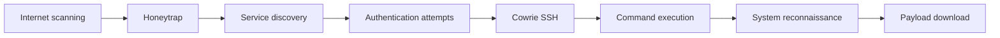

# Attack Lifecycle Observed Through T-Pot

The report supports a layered view of attacker interaction:

## Honeytrap

Captures connection-level activity and scanning behaviour.

## Cowrie

Captures SSH sessions where attackers interact with the simulated shell.

## Post-compromise indicators

The report documents:

- System identification commands.
- Encoded command execution.
- Downloaded Redtail payload variants.
- Repeated activity from cloud/hosting infrastructure.

This layered model is the main value of combining multiple T-Pot sensors: different sensors expose different stages and levels of attacker interaction.
